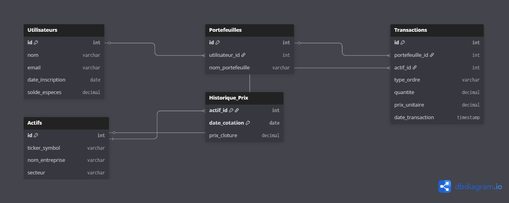

# FinTrack-DB : Conception & Analyse de Base de Données (PostgreSQL)


## Contexte du Projet
Ce projet personnel a été réalisé pour démontrer mes compétences en **ingénierie des données** et en **conception de systèmes d'information**. Il s'agit de la modélisation et de l'exploitation relationnelle d'une plateforme de gestion de portefeuilles boursiers (type eToro / Boursorama). 

Ce projet allie mon intérêt pour les marchés financiers et le Back-End / Data Engineering, s'inscrivant parfaitement dans mon projet d'intégrer un Master MIAGE.

## Technologies Utilisées
* **SGBD** : PostgreSQL
* **Modélisation** : DBML / dbdiagram.io
* **Concepts SQL** : DDL/DML, Contraintes (CHECK, FK), CTE (Common Table Expressions), Window Functions, Agrégations conditionnelles.

## Modélisation Conceptuelle (Schéma Relationnel)



**Justification des choix de cardinalités :**
* Un `Utilisateur` peut avoir plusieurs `Portefeuilles` (1:N), permettant de séparer PEA et Compte-Titres.
* Une `Transaction` est liée à un seul `Portefeuille` et un seul `Actif` (N:1).
* L'`Historique_Prix` utilise une **clé primaire composite** `(actif_id, date_cotation)` pour garantir une seule valeur de clôture par jour et par action.

## Extraits de requêtes analytiques avancées

L'objectif de cette base n'est pas seulement de stocker, mais d'analyser. Voici quelques requêtes clés tirées de mon fichier `analytics_queries.sql`.

### 1. Valorisation en temps réel des portefeuilles (CTE & Agrégation conditionnelle)
Cette requête calcule la position nette de chaque utilisateur (Achats - Ventes) et la croise avec le dernier cours de clôture connu pour donner la valeur totale de son portefeuille.

```sql
WITH PositionsActuelles AS (
    SELECT p.utilisateur_id, t.actif_id,
        SUM(CASE WHEN t.type_ordre = 'ACHAT' THEN t.quantite ELSE -t.quantite END) AS qte
    FROM Transactions t JOIN Portefeuilles p ON t.portefeuille_id = p.id
    GROUP BY p.utilisateur_id, t.actif_id
),
DerniersPrix AS (
    SELECT actif_id, prix_cloture FROM Historique_Prix hp1
    WHERE date_cotation = (SELECT MAX(date_cotation) FROM Historique_Prix hp2 WHERE hp1.actif_id = hp2.actif_id)
)
SELECT u.nom, SUM(pa.qte * dp.prix_cloture) AS valorisation_totale
FROM PositionsActuelles pa
JOIN DerniersPrix dp ON pa.actif_id = dp.actif_id
JOIN Utilisateurs u ON pa.utilisateur_id = u.id
GROUP BY u.nom;
```

### 2. Analyse technique : Moyenne mobile sur 7 jours (Window Functions)
Utilisation de `OVER PARTITION BY` pour le traitement de séries temporelles (Time Series), très utilisé en finance de marché.

```sql
SELECT 
    a.ticker_symbol, hp.date_cotation, hp.prix_cloture,
    ROUND(AVG(hp.prix_cloture) OVER (
        PARTITION BY hp.actif_id 
        ORDER BY hp.date_cotation 
        ROWS BETWEEN 6 PRECEDING AND CURRENT ROW
    ), 2) AS moyenne_mobile_7j
FROM Historique_Prix hp
JOIN Actifs a ON hp.actif_id = a.id
WHERE a.ticker_symbol = 'AAPL';
```

## Comment tester le projet ?
1. Cloner le repository.
2. Exécuter le script `schema_and_data.sql` sur une instance PostgreSQL.
3. Lancer les requêtes du fichier `analytics_queries.sql` pour observer les résultats.